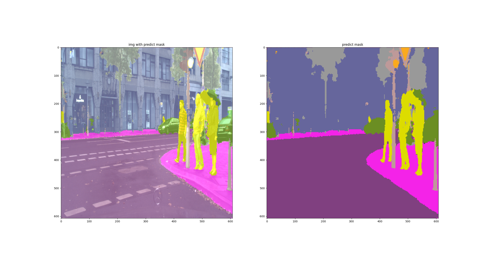
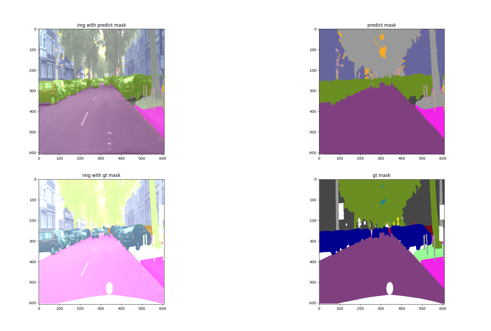

# yolov5-segmentation
yolov5 for semantic segmentation which based on [flexible-yolov5](https://github.com/yl305237731/flexible-yolov5).


## Table of contents
* [Features](#features)
* [Prerequisites](#prerequisites)
* [Getting Started](#getting-started)
    * [Dataset Preparation](#dataset-preparation)
    * [Training](#training)
    * [Visualization](#visualization)
* [Reference](#Reference)


## Features
- Provide model structure, such as backbone, neck, head, can modify the network flexibly and conveniently
- backbone: yolov5s
- neck: FPN, PAN
- head: segmentation head

## Prerequisites

please refer to `requirements.txt`

## Getting Started

### Dataset Preparation

1. Download coco or cityscapes dataset.
2. Modify your dataset path in  `configs/data.yaml`.

### Dataset Notice

There are some modifies in classes grouping with `cityscapes dataset`. 
-  Change: 19 classes ——> 9 classes (See the code details in [cityscapes.py](data/dataloaders/datasets/cityscapes.py). But don't worry, I have add the input param `group(bool)` which can be set as `False` to backend 19 classes in training and visualizing. )


### Training
For training, it's same like yolov5.

You can modify your setup in `train_cityscapes.sh`.
```shell script
$ ./train_cityscapes.sh
```
Tensorboard is automatically started while training. You can see the visualizition results in tensorboard.


### Visualization

You can modify your setup in `visualize.sh`.
```shell script
$ ./visualize.sh
```

**Here is the visualization of cityscapes with 9 classes(ground truth is 19 classes).**







## Reference

* [ultralytics/yolov5](https://github.com/ultralytics/yolov5)
